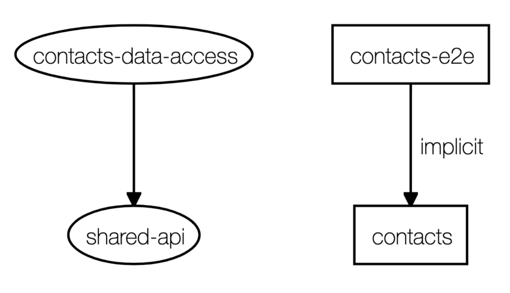

### Lab (2b): Create Shared-API Library

The `Contacts` model and other interfaces could be used by 1..n web apps and 1..n server apps...
Creating a distinct API typescript library allows the models/interfaces to be shared.

#### Scenario

Let's create a TypeScript library in `libs/shared/api` using the Nx tools.

Then we will:

- move the `Contact` interface into that library,
- define a public API (in the `index.ts`),
- enforce public API boundaries (`.eslintrc`)
- update the Data-Access library to import the `Contact` from the Shared-API library.



<br>

---

#### Tasks

1. Use a terminal to run the command

```console
nx g @nrwl/web:lib api --directory=shared --dryRun
```

3. move the **Contact** interface file
   - from `/libs/contacts/data-access/src/lib/contact.model.ts`
   - to `/libs/shared/api/src/lib/contacts/contact.model.ts`
4. update the Shared-API library public API to export the `Contact` interface.
5. update the Data-Access\* library public API to re-export the `Contact` interface.
6. Update the imports of the **Contact** interface to use the new Shared-API library
   - from `import { Contact } from './contacts.model';`
   - to `import { Contact } from '@workshop/shared/api';`

<br>

> Be prepared to talk about why `export * from '@workshop/shared/api'` was used.

---

<br>

#### Code Snippets

<br>

##### `libs/contacts/data-access/src/lib/index.ts`

```ts
export * from '@workshop/shared/api';
export * from './lib/contacts.service';
```

##### `libs/shared/api/src/lib/shared-api.ts`

```ts
export * from './contacts/contacts.model';
```

<br>
<br>
<br>
